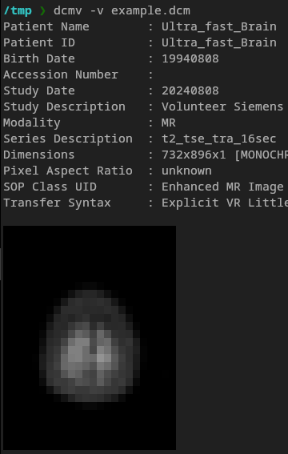
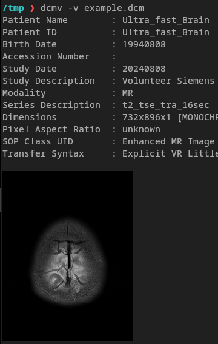

# dcmv

`dcmv` is a cross-platform terminal-based DICOM image viewer. It displays DICOM images and their metadata directly in the terminal.

This is an initial non-interactive implementation. The purpose is a quick preview of DICOM files without leaving the terminal.

In modern terminals that support image protocols (e.g., Kitty, Ghostty, iTerm2, WezTerm), images are displayed in higher resolution.

## TL;DR

| Terminal without image support  | Terminal with image support     |
|---------------------------------|---------------------------------|
|  |  |

## Examples

### Display multiple DICOM files (no metadata)
```bash
dcmv *.dcm
```

### Display one DICOM file extra wide, with metadata
```bash
dcmv file1.dcm -W 80 -v
```

### Display one DICOM file extra wide, with metadata, forcing lower quality

Piping the output to `cat`, `less -r`, or any other program will disable the high-resolution image protocol. Image will be lower resolution.

```bash
dcmv file1.dcm -W 80 -v | cat
```

### Download DICOM file using `curl` and display it
```bash
curl -s https://marketing.webassets.siemens-healthineers.com/9af51e5a5a75528f/915124f7f1b1/IMG-0001-00001.dcm | dcmv
```

### Use StoreSCP to receive and preview DICOM instances

Server/StoreSCP (from [dcmtk](https://dcmtk.org/en/dcmtk/dcmtk-tools/)):
```bash
# Listen on port 10400, saving incoming files to /tmp/dicom,
# printing them with height of 20, with filename and metadata:
storescp 10400 -od /tmp/dicom/ --exec-on-reception "dcmv #p/#f -vF -H20"
```

Client:
```bash
# send example file to the SCP
dcmsend localhost 10400 file1.dcm
```

## Installation

Use [Cargo](https://rustup.rs) to install `dcmv` from this git repository:

```bash
cargo install dcmv --git https://github.com/realcundo/dcmv
```

## Limitations

The goal is to have a quick previewer, not a fully featured DICOM viewer.
That said, the more files are supported, the better.

Currently
- not all terminals and all operating systems are fully supported.
- no windowing or LUT support
- not all transfer syntaxes are supported
- multiframe DICOM files are partially supported (the first frame is displayed)

Adding additional support might be possible, depending on whether upstream crates (`dicom-rs` and `gdcm-rs`)
make it possible.

## Usage

```bash
dcmv <FILE> [<FILE2> ..]
```

### Options

- `<FILE>`: One or more DICOM file paths.
- `-W`, `--width <WIDTH>` (optional): Set the output width in terminal columns.
- `-H`, `--height <HEIGHT>` (optional): Set the output height in terminal rows.
- `-v`, `--verbose` (optional): Show DICOM metadata.
- `-F`, `--filename` (optional): Show filename before the image.

## License

`dcmv` is dual-licensed under both the MIT and Apache 2.0 licenses. See `LICENSE-MIT` and `LICENSE-APACHE` for full details.
